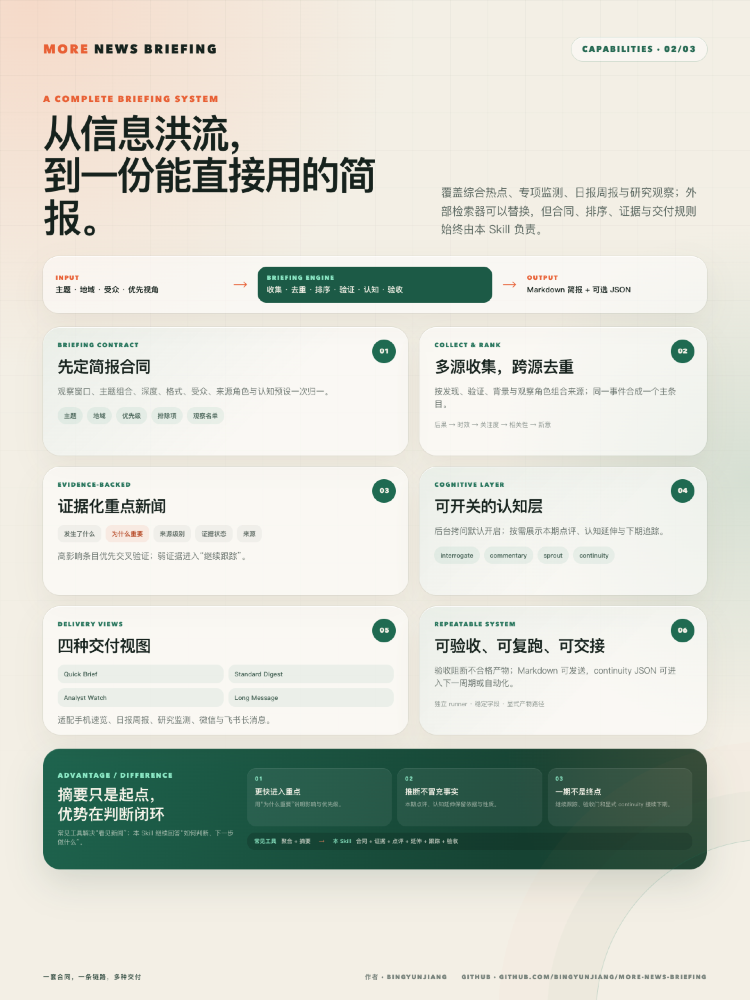

<div align="center">

# 江丙云 | Bingyun Jiang

**工程研究者 · 技术作者 · AI 科研工作流开发者**

把工程知识、学术研究与人工智能工具连接起来，构建可信、可追溯、可复用的研究工作流。

[](https://github.com/bingyunjiang)
[](mailto:bingyunjiang@qq.com)

</div>

## 关于我

你好 👋 我是江丙云。白天搞工程仿真和 CAE，晚上折腾 AI 科研工作流。一个在工程学界和技术世界之间反复横跳的研究者。

- 🎓 上海交通大学工学博士、📍 浙江大学工程博士
- 📚 已出版 5 本工程技术著作（有限元/CAE 方向）
- 🤖 关注 AI Agent、学术研究自动化、证据驱动写作与知识工作流
- 🧠 致力于让 AI 不只是生成文字，而是参与真实、透明、可审计的研究过程

我目前重点探索的是：如何把文献检索、PDF 获取、Zotero 管理、论文写作、引用审计与信息简报整合为可复用的 AI 工作流，让研究者把精力花在判断上，而不是搬运上。

## 研究与实践方向

- **AI for Research**：面向真实文献和证据链的学术研究辅助
- **AI Agent Workflows**：可中断、可回溯、可审计的智能体工作流
- **Scientific Computing**：有限元分析、CAE、Abaqus 与工程仿真
- **Knowledge Engineering**：文献管理、知识组织、信息检索与结构化输出

## GitHub 统计

[](https://github.com/bingyunjiang?tab=followers)
[](https://github.com/bingyunjiang?tab=repositories)

## 开源项目

### [more-paper-workflow](https://github.com/bingyunjiang/more-paper-workflow)

面向中文及双语论文写作的证据闭环工作流，覆盖定题、检索、PDF 下载、Zotero 文献管理、论文写作、引用审计与润色。项目强调真实文献、过程透明和结果可追溯。

[](https://github.com/bingyunjiang/more-paper-workflow)

### [more-sci-figure](https://github.com/bingyunjiang/more-sci-figure)

本地优先、证据可追溯的科研图表数据提取、人工复核、论文级重绘与交付验证工具。项目将算法结果视为候选值，通过来源哈希、质量门和人工复核形成可审计的数据与图表工作流。

[](https://github.com/bingyunjiang/more-sci-figure)

### [more-news-briefing](https://github.com/bingyunjiang/more-news-briefing)

可复用的新闻与行业信息简报工作流，将分散信息经过收集、去重、排序和证据核验，整理为结构稳定、来源清晰、可直接交付的资讯摘要。

[](https://github.com/bingyunjiang/more-news-briefing)

### [more-comic-digitizer](https://github.com/bingyunjiang/more-comic-digitizer)

面向儿童手绘漫画的本地数字化工具，可将拍照或扫描页面整理为可编辑、可审核、可导出的项目，同时保护原作、儿童作者权和家庭隐私，并清晰区分原作、已确认、推断与 AI 共创内容。

[](https://github.com/bingyunjiang/more-comic-digitizer)

*虚构案例宣传图（AI-created），不包含真实儿童或家庭信息。*

## 代表著作（已出版 5 本，以下为部分代表作）

- 《ABAQUS 工程实例详解》，人民邮电出版社，2014
- 《ABAQUS Python 二次开发攻略》，人民邮电出版社，2016
- 《ABAQUS 分析之美》，人民邮电出版社，2018
- 《ANSYS Workbench 有限元分析工程实例详解》，中国铁道出版社

## 代表论文

1. **Bingyun Jiang**, Shaorui Zhang. "The effects of strain rate and grain size on nanocrystalline materials: A theoretical prediction." *Materials & Design*, 87, 49–52, 2015. [DOI: 10.1016/j.matdes.2015.08.012](https://doi.org/10.1016/j.matdes.2015.08.012) — 被引 14 次
2. **Bingyun Jiang**, Li Li, Huilin Huang. "A structural analysis method for plastics (SAMP) based on integral constitutive model." *AECE 2016*. [DOI: 10.2991/aest-16.2016.130](https://doi.org/10.2991/aest-16.2016.130)
3. **Bingyun Jiang**, Chen Tian. "Integrated Prediction of Mechanical Behavior for the Non-Aging Materials at Various Strain Rates." *Journal of Engineering Materials and Technology*, 143(1), 2021. [DOI: 10.1115/1.4047744](https://doi.org/10.1115/1.4047744)
4. **Bingyun Jiang**, Jun-lei Liu, Zhenyu Liu, Hui Liu, Hong Jiang. "Analysis and optimization of injection molding for the part of EV charging equipment." *The International Journal of Advanced Manufacturing Technology*, 2025. [DOI: 10.1007/s00170-025-15847-7](https://doi.org/10.1007/s00170-025-15847-7)
5. **Bingyun Jiang**, Peng Hu, Zhenyu Liu, Pengfei Yuan, Hui Liu. "GA-BP Neural Network-Based Prediction of Impact Resistance in Electric Vehicle Charging Gun." *SAE International Journal of Materials and Manufacturing*, 2025. [DOI: 10.4271/05-18-04-0028](https://doi.org/10.4271/05-18-04-0028)
6. **Bingyun Jiang**, Qi Zhou, Zhenyu Liu, Hui Liu, Peng Hu, Feifei Lu. "Air Duct Design and Heat Dissipation Optimization for a 480 kW Charging Pile." *Journal of Thermal Science and Engineering Applications* (ASME), 2026. [DOI: 10.1115/1.4071794](https://doi.org/10.1115/1.4071794)

## 技术栈与工具

**语言和平台**：Python · JavaScript · Shell · Abaqus Scripting (Python) · MATLAB

**AI / 框架**：Codex API · OpenAI API · LLM Agentic Workflows · RAG

**工程工具**：Abaqus / CAE · ANSYS Workbench · FEA / FEM · Scientific Computing

**知识管理**：Zotero · Obsidian · Markdown · Git

## 当前关注

```text
真实文献 → 证据组织 → AI 协作 → 引用审计 → 可复现交付
```

我相信 AI 科研工具的价值不在于生成速度，而在于过程透明。好的工具应该让研究者始终握有判断权，让每个结论都能追溯到它的证据来源。

---

## English

I am **Bingyun Jiang** (Dr. Jiang, Zhejiang University), an engineering researcher, technical author, and builder of AI-assisted research workflows. My work sits at the intersection of finite element analysis, injection molding simulation, structural optimization, and agentic AI — building research processes that are transparent, traceable, and reproducible.

My research spans constitutive modeling of nanocrystalline materials, polymer structural analysis (SAMP), integrated mechanical prediction, EV charging equipment simulation and optimization, and AI-driven engineering prediction. More recently, I've been focused on AI for research, evidence-grounded academic writing, and agentic workflows.

I also maintain four open-source projects: [more-paper-workflow](https://github.com/bingyunjiang/more-paper-workflow) (an evidence-closed-loop writing workflow), [more-sci-figure](https://github.com/bingyunjiang/more-sci-figure) (a local-first, auditable scientific figure extraction and redrawing workflow), [more-news-briefing](https://github.com/bingyunjiang/more-news-briefing) (a structured news briefing pipeline), and [more-comic-digitizer](https://github.com/bingyunjiang/more-comic-digitizer) (a provenance-aware digitization workflow for children's hand-drawn comics).

I believe good research AI doesn't replace human judgment — it makes evidence easier to inspect, decisions easier to trace, and scholarly work easier to reproduce.
