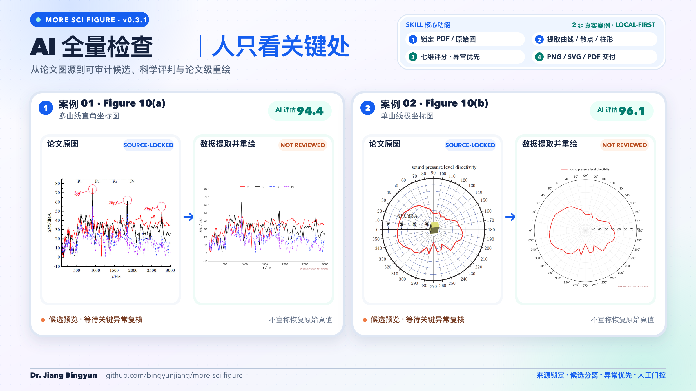

<div align="center">

# 江丙云 | Bingyun Jiang

**工程研究者 · 技术作者 · AI 科研与可视化工作流开发者**

把工程知识、学术研究、信息认知与可编辑视觉工具连接起来，构建可信、可追溯、可复用的 AI 工作流。

[](https://github.com/bingyunjiang)
[](mailto:bingyunjiang@qq.com)

</div>

## 关于我

你好 👋 我是江丙云。白天搞工程仿真和 CAE，晚上折腾 AI 科研工作流。一个在工程学界和技术世界之间反复横跳的研究者。

- 🎓 上海交通大学工学博士、📍 浙江大学工程博士
- 📚 已出版 5 本工程技术著作（有限元/CAE 方向）
- 🤖 关注 AI Agent、学术研究自动化、证据驱动写作与知识工作流
- 🧠 致力于让 AI 参与真实的科研、CAE 与可编辑知识生产

我正在持续开发 `more-*` 系列 Agent Skills：从论文证据链、科研图表和新闻简报，到儿童漫画数字化、对话式 Excalidraw 与飞书可编辑白板转换。它们彼此独立，但共同坚持本地优先、人工门控、过程可审计和结果可复现。

## 研究方向

- **AI for Research**：面向真实文献和证据链的学术研究辅助
- **AI Agent Workflows**：可中断、可回溯、可审计的智能体工作流
- **Scientific Computing**：有限元分析、CAE、Abaqus 与工程仿真
- **Scientific Visualization**：科研图表提取、异常复核、论文级重绘与验证
- **Editable Knowledge Tools**：Excalidraw、飞书白板与结构化知识的可编辑转换

## More 系列项目

`more-*` 是一组面向真实研究、信息处理与内容创作任务的独立 Agent Skills。每个项目独立安装、独立运行、独立验收；系列名称表示共同的工程原则，不表示项目会自动互相调用或共享状态。

### 公开项目

#### [more-paper-workflow](https://github.com/bingyunjiang/more-paper-workflow)

从研究问题到可核验论文的八步证据闭环，支持任意步骤直达，覆盖定题、检索、PDF 路由、Zotero 对齐、证据化写作、公式与引用审计、科研图表、论文流程图和保守润色。

[](https://github.com/bingyunjiang/more-paper-workflow)

#### [more-sci-figure](https://github.com/bingyunjiang/more-sci-figure)

本地优先、证据可追溯的科研图表工作流。AI 全量检查图源、标定、候选数据和异常风险，让用户只复核关键处，再生成可编辑数据、论文级 PNG/SVG/PDF 和独立验证记录。

[](https://github.com/bingyunjiang/more-sci-figure)

#### [more-news-briefing](https://github.com/bingyunjiang/more-news-briefing)

可复用的多主题新闻与行业监测工作流。它先锁定主题、周期、受众和来源契约，再完成收集、去重、排序、核验、认知层分析、跨周期跟踪与多视图交付。

[](https://github.com/bingyunjiang/more-news-briefing)

### 私有开发与本地在研

#### more-comic-digitizer · 私有开发

面向儿童手绘漫画的本地数字化与完整成书工作流。它保留不可变原作，支持非破坏式处理、OCR、故事与分镜协作、角色一致性、人工审核及 EPUB/PDF/CBZ 双版本导出，并清晰区分原作、已确认、推断与 AI 共创内容。


*虚构案例宣传图（AI-created），不包含真实儿童或家庭信息。*

#### Excalidraw × 飞书可编辑工具链

| 项目 | 当前状态 | 核心用途 |
| --- | --- | --- |
| `more-chat-excalidraw` | 私有开发 | 自然对话、文档、Mermaid 或知识图谱 → 结构化 IR → 可编辑 Excalidraw；支持模板选择、严格校验、实时预览和增量迭代 |
| `more-excalidraw-feishu` | 私有开发 | Excalidraw 画布 → 飞书可编辑白板；保留元素布局、颜色、结构和手绘参考图，浏览器一键导出仍标记为 experimental |
| `more-feishu-excalidraw` | 本地在研 | 飞书文档 → 可编辑 Excalidraw 的可审计转换；显式记录支持、近似与未支持内容，真实外部写回仅在授权后执行 |

```text
自然语言 / 文档 / Mermaid → more-chat-excalidraw → Excalidraw 画布
Excalidraw 画布            → more-excalidraw-feishu → 飞书可编辑白板
飞书文档                   → more-feishu-excalidraw → Excalidraw 画布
```

## 代表著作（已出版 5 本，以下为部分代表作）

- 《ABAQUS 工程实例详解》，人民邮电出版社，2014
- 《ABAQUS Python 二次开发攻略》，人民邮电出版社，2016
- 《ABAQUS 分析之美》，人民邮电出版社，2018
- 《ANSYS Workbench 有限元分析工程实例详解》，中国铁道出版社

## 代表论文

1. **Bingyun Jiang**, Shaorui Zhang. "The effects of strain rate and grain size on nanocrystalline materials: A theoretical prediction." *Materials & Design*, 87, 49–52, 2015. [DOI: 10.1016/j.matdes.2015.08.012](https://doi.org/10.1016/j.matdes.2015.08.012) — 被引 14 次
2. **Bingyun Jiang**, Li Li, Huilin Huang. "A structural analysis method for plastics (SAMP) based on integral constitutive model." *AECE 2016*. [DOI: 10.2991/aest-16.2016.130](https://doi.org/10.2991/aest-16.2016.130)
3. **Bingyun Jiang**, Chen Tian. "Integrated Prediction of Mechanical Behavior for the Non-Aging Materials at Various Strain Rates." *Journal of Engineering Materials and Technology*, 143(1), 2021. [DOI: 10.1115/1.4047744](https://doi.org/10.1115/1.4047744)
4. **Bingyun Jiang**, Jun-lei Liu, Zhenyu Liu, Hui Liu, Hong Jiang. "Analysis and optimization of injection molding for the part of EV charging equipment." *The International Journal of Advanced Manufacturing Technology*, 2025. [DOI: 10.1007/s00170-025-15847-7](https://doi.org/10.1007/s00170-025-15847-7)
5. **Bingyun Jiang**, Peng Hu, Zhenyu Liu, Pengfei Yuan, Hui Liu. "GA-BP Neural Network-Based Prediction of Impact Resistance in Electric Vehicle Charging Gun." *SAE International Journal of Materials and Manufacturing*, 2025. [DOI: 10.4271/05-18-04-0028](https://doi.org/10.4271/05-18-04-0028)
6. **Bingyun Jiang**, Qi Zhou, Zhenyu Liu, Hui Liu, Peng Hu, Feifei Lu. "Air Duct Design and Heat Dissipation Optimization for a 480 kW Charging Pile." *Journal of Thermal Science and Engineering Applications* (ASME), 2026. [DOI: 10.1115/1.4071794](https://doi.org/10.1115/1.4071794)

## 技术栈与工具

**语言和平台**：Python · TypeScript / JavaScript · Shell · Abaqus Scripting (Python) · MATLAB

**AI / 框架**：Codex · OpenAI API · LLM Agentic Workflows · RAG · MCP

**工程工具**：Abaqus / CAE · ANSYS Workbench · FEA / FEM · Scientific Computing

**知识与可视化**：Zotero · Excalidraw · Feishu / Lark · SVG · Markdown · Git

## 当前关注

```text
真实来源 → 可审计中间产物 → 人工门控 → 可编辑交付 → 可复现验证
```

我相信 AI 科研工具的价值不在于生成速度，而在于过程透明。好的工具应该让研究者始终握有判断权，让每个结论都能追溯到它的证据来源。

---

## English

I am **Bingyun Jiang** (Dr. Jiang, Zhejiang University), an engineering researcher, technical author, and builder of AI-assisted research workflows. My work sits at the intersection of finite element analysis, injection molding simulation, structural optimization, and agentic AI — building research processes that are transparent, traceable, and reproducible.

My research spans constitutive modeling of nanocrystalline materials, polymer structural analysis (SAMP), integrated mechanical prediction, EV charging equipment simulation and optimization, and AI-driven engineering prediction. More recently, I've been focused on AI for research, evidence-grounded academic writing, and agentic workflows.

I build the `more-*` family of independent Agent Skills. The public repositories are [more-paper-workflow](https://github.com/bingyunjiang/more-paper-workflow), [more-sci-figure](https://github.com/bingyunjiang/more-sci-figure), and [more-news-briefing](https://github.com/bingyunjiang/more-news-briefing). Private or in-development projects cover provenance-aware comic digitization, natural-language-to-Excalidraw generation, Excalidraw-to-Feishu whiteboard conversion, and auditable Feishu-to-Excalidraw conversion.

I believe good research AI doesn't replace human judgment — it makes evidence easier to inspect, decisions easier to trace, and scholarly work easier to reproduce.
